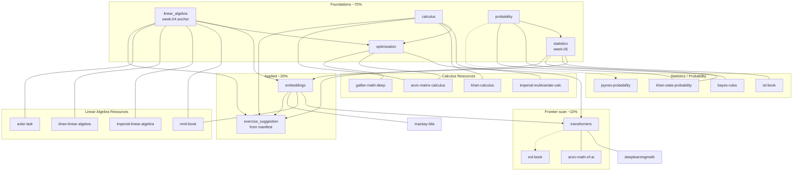

# Lesson–Resource Graph

Visual map of how math lessons connect to curated resources and remediation paths.



## Weakness Remediation Edges

When a learner tags a weakness, follow the edge to the highest-priority resource:

| Weakness tag | First resource | Commute alt | Open PDF |
|--------------|----------------|-------------|----------|
| `dot_product` | `khan-linear-algebra` | `imperial-linear-algebra` | — |
| `matrix_multiply` | `mml-book` | `imperial-linear-algebra` | `arxiv-matrix-calculus` |
| `chain_rule` | `imperial-multivariate-calc` | same | — |
| `jacobian` | `imperial-multivariate-calc` | — | `arxiv-matrix-calculus` |
| `mean_variance` | `khan-stats-probability` | same | — |
| `conditional_probability` | `bayes-rules` | `khan-stats-probability` | — |
| `gradient_descent` | `imperial-multivariate-calc` | — | `arxiv-matrix-calculus` |
| `entropy` | `mackay-itila` | — | — |
| `attention_derivation` | `deeplearningmath` | — | `arxiv-math-of-ai` |

## Course Week Alignment (Month 1)

```
week-04-linear-algebra-foundations ──► linear_algebra ──► mml-book, khan-linear-algebra, imperial-linear-algebra
week-05-statistics (scaffold)        ──► statistics, probability ──► isl-book, khan-stats-probability, bayes-rules
week-06-numpy-pandas (scaffold)      ──► embeddings (bridge) ──► mml-book, exercise packs
Month 2+                             ──► calculus, optimization, transformers
```

## Storage Flow

```
dair-ai/Mathematics-for-ML (index)
        │
        ▼
ingest_math_resources.py
        │
        ├──► ingestion_manifest.json (repo)
        ├──► resource_metadata_index.json (repo)
        │
        ├──► [open PDFs only] ──► /Volumes/AI_MODELS/AI_LIBRARY/math/pdfs/
        │                              │
        │                              ▼
        │                    calibre_import_queue/ (repo staging metadata)
        │                              │
        │                              ▼ manual
        │                    /Volumes/AI_MODELS/AI_LIBRARY/calibre-library/
        │
        ├──► notebooklm_pack_queue/ (repo)
        │         └── manual paste ──► NotebookLM Audio Overview
        │
        └──► commuter_review_queue/ (repo)
                  └── manual review on commute
```

## Metadata Fields (all resources)

| Field | Purpose |
|-------|---------|
| `lesson` | Primary lesson slug(s) |
| `topic` | Human topic label |
| `difficulty` | beginner / intermediate / advanced |
| `reinforcement_priority` | high / medium / low |
| `commute_friendly` | Suitable for audio/video commute |
| `source_type` | open_pdf, web_book, paper, course, video_playlist, reference |
| `copyright_status` | open_access, web_free, reference, commercial_web |
| `local_path` | Path under AI_LIBRARY after download |
| `weakness_tags` | Remediation lookup keys |
