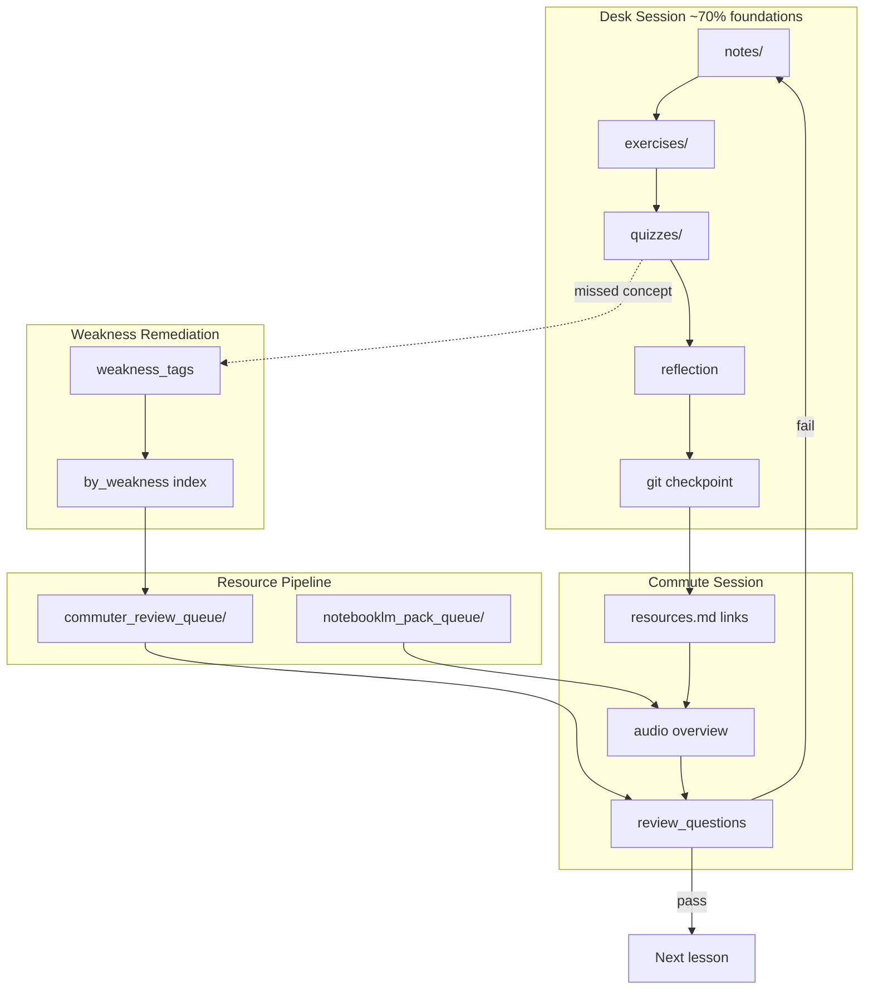

# Commuter Reinforcement Workflow

How to use commute time to reinforce lessons without automating external logins.

**Operating rule:** 70% foundations · 20% applied · 10% frontier scan  
**Policy:** Manual review only — no automated YouTube, Google, or NotebookLM login.

---

## Purpose

Commuter reinforcement closes the loop between **structured lesson time** (notes, exercises, quizzes) and **spaced recall** during drives, walks, or transit. It is the human-facing half of the reinforcement loop architecture.

---

## Reinforcement Loop Architecture



---

## Two Commuter Layers

### Layer A — Per-lesson commuter (authoring)

Every ready lesson includes `commuter/` with four files:

| File | Purpose |
|------|---------|
| `resources.md` | Curated public links — open manually |
| `notebooklm_source_pack.md` | Paste-ready text for NotebookLM |
| `audio_overview_prompt.md` | Prompt for local LLM or TTS prep |
| `review_questions.md` | Rapid recall questions |

Templates: `courses/_templates/commuter/`

### Layer B — Resource pipeline commuter (generated)

For each curated math resource:

| File | Path |
|------|------|
| Review metadata | `courses/math/resources/commuter_review_queue/{id}.json` |

Generated by `ingest_math_resources.py` and refreshed by `sync_ai_library.py --apply`.

Contains: `review_questions`, `exercise_suggestion`, `weakness_tags`, `commute_friendly`, `reinforcement_priority`.

---

## Commute Session Protocol (15–25 min)

### Before you leave

1. Identify today's lesson or weakness tag from quiz/reflection.
2. Open the lesson's `commuter/review_questions.md` **or** the matching `{id}.json` from `commuter_review_queue/`.
3. If using audio: open `notebooklm_source_pack.md` or queue pack — do **not** automate login.

### During commute

**Option A — Audio (preferred for `commute_friendly: true` resources)**

1. Generate NotebookLM Audio Overview manually (see [NOTEBOOKLM_INTEGRATION_GUIDE.md](./NOTEBOOKLM_INTEGRATION_GUIDE.md)), **or**
2. Paste `audio_overview_prompt.md` into Ollama/Claude and listen via TTS.

**Option B — Video (manual)**

1. Open one link from `resources.md` or the resource URL in the queue JSON.
2. Watch one playlist segment — no automated fetching.

**Option C — Recall only**

1. Answer `review_questions.md` aloud from memory.

### After commute

1. Mark self-check boxes in `review_questions.md`.
2. If recall failed → tag weakness → run remediation (below).
3. If recall passed → proceed to next lesson or applied exercise.

---

## Commute-Friendly Resource Selection

Use `resource_metadata_index.json`:

```json
{
  "commute_friendly": true,
  "reinforcement_priority": "high"
}
```

**Month 1 priority commute resources:**

| Resource ID | Lesson | Type |
|-------------|--------|------|
| `imperial-linear-algebra` | linear_algebra | video playlist |
| `khan-linear-algebra` | linear_algebra | course |
| `khan-stats-probability` | statistics | course |
| `imperial-multivariate-calc` | calculus | video playlist |

Dense PDFs (`commute_friendly: false`) are for desk study — use NotebookLM to convert to audio first.

---

## Weakness Remediation Process

Triggered when a quiz, reflection, or commute review exposes a gap.

```mermaid
flowchart TD
    A[Identify weakness] --> B[Find tag in quiz or self-assessment]
    B --> C[Lookup by_weakness in resource_metadata_index.json]
    C --> D{Commuting?}
    D -->|Yes| E[Pick commute_friendly: true resource]
    D -->|No| F[Pick highest reinforcement_priority]
    E --> G[Open commuter_review_queue/{id}.json]
    F --> G
    G --> H[Complete review_questions + exercise_suggestion]
    H --> I{Pass?}
    I -->|No| J[Re-read lesson notes + redo exercise]
    I -->|Yes| K[Update personal PROGRESS.md optional]
    J --> H
```

### Example

**Weakness:** `dot_product` missed on linear algebra quiz

1. Lookup: `resource_metadata_index.json` → `by_weakness.dot_product`
2. Returns: `khan-linear-algebra`, `imperial-linear-algebra`
3. Commute: open `commuter_review_queue/khan-linear-algebra.json`
4. Desk: redo `week-04-linear-algebra-foundations/exercises/linear_algebra_foundations.py`
5. Applied (20%): extend exercise to compare three embedding vectors

---

## 70 / 20 / 10 in Commuter Design

| Tier | Commuter focus |
|------|----------------|
| **70% Foundations** | Review questions tied to anchor lessons; Khan/Imperial playlists; MML notation |
| **20% Applied** | `exercise_suggestion` from manifest; capstone prep questions |
| **10% Frontier** | Low-priority scan questions (e.g. `arxiv-math-of-ai`); no deep commute study required |

Do not let frontier scan content crowd out foundation review during Month 1.

---

## Manual-Only Boundaries

| Service | Allowed | Not allowed |
|---------|---------|---------------|
| YouTube | Open playlist URL in browser | Automated login, transcript scraping bots |
| NotebookLM | Paste source pack manually | Google login automation |
| Ollama | Local audio prompt generation | — |
| Public links in `resources.md` | Click and read/watch | Scraping paywalled content |

---

## File Quick Reference

| Need | Location |
|------|----------|
| Lesson commute pack | `courses/{track}/week-XX/commuter/` |
| Math resource review | `courses/math/resources/commuter_review_queue/` |
| Weakness lookup | `courses/math/resources/resource_metadata_index.json` |
| Lesson → resource map | `courses/math/resources/lesson_resource_links.json` |
| Quality gate | `automation/LESSON_CHECKLIST.md` |

---

## Related

- [NOTEBOOKLM_INTEGRATION_GUIDE.md](./NOTEBOOKLM_INTEGRATION_GUIDE.md)
- [WEEKLY_LEARNING_LOOP.md](./WEEKLY_LEARNING_LOOP.md)
- [RESOURCE_PIPELINE_OVERVIEW.md](./RESOURCE_PIPELINE_OVERVIEW.md)
