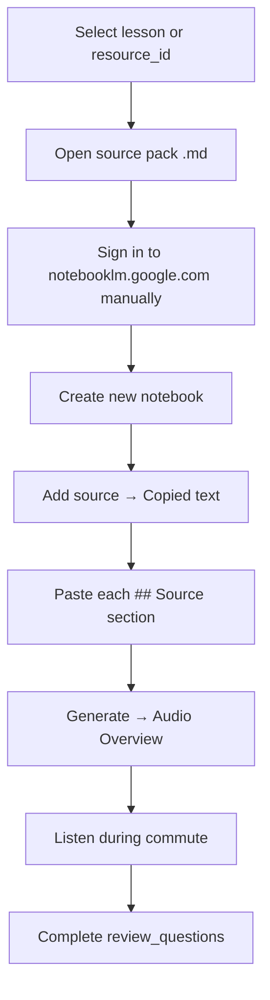

# NotebookLM Integration Guide

Manual workflow for generating audio overviews from course source packs.

**Policy:** Paste sources manually. **Do not** automate Google or NotebookLM login.

---

## Purpose

NotebookLM converts curated text sources into **Audio Overviews** — useful for commuter reinforcement of foundation lessons and math resources. The course OS generates source packs; the learner performs all Google-side steps manually.

---

## Source Pack Locations

### Per-lesson packs (authoring)

```
courses/{track}/week-XX-topic/commuter/notebooklm_source_pack.md
```

Example: `courses/math/week-04-linear-algebra-foundations/commuter/notebooklm_source_pack.md`

### Resource pipeline packs (generated)

```
courses/math/resources/notebooklm_pack_queue/{resource_id}.md
```

Mirrored to (after sync `--apply`):

```
/Volumes/AI_MODELS/AI_LIBRARY/notebooklm_packs/{resource_id}.md
```

Regenerate queues:

```bash
python automation/scripts/sync_ai_library.py --apply
```

---

## Source Pack Structure

Each pack contains paste-ready `## Source:` sections:

1. **Overview** — title, authors, URL, lesson mapping
2. **AI Engineering Connection** — why this matters for AI work
3. **Key Concepts / Glossary** — terms to retain
4. **Exercise Walkthrough** — what the learner built
5. **Common Mistakes** — pitfalls
6. **Commuter Review Hook** — pointer to review questions

Template: `courses/_templates/commuter/notebooklm_source_pack.md`

---

## Manual Workflow



### Step-by-step

1. **Choose content**
   - Lesson: open `commuter/notebooklm_source_pack.md` in the week folder
   - Math resource: open `notebooklm_pack_queue/mml-book.md` (or relevant ID)

2. **Open NotebookLM**
   - Navigate to https://notebooklm.google.com/
   - Sign in with your Google account manually

3. **Create notebook**
   - Name it after the lesson (e.g. `Linear Algebra Foundations` or `MML Book`)

4. **Add sources**
   - Click **Add source** → **Copied text**
   - Paste one `## Source:` block per source (or combine — fewer sources = shorter overview)
   - Do **not** paste paywalled or scraped web content — only pack text

5. **Generate Audio Overview**
   - Click **Generate** → **Audio Overview**
   - Wait for processing (typically a few minutes)

6. **Review**
   - Listen during commute
   - Complete matching `review_questions.md` or `commuter_review_queue/{id}.json`

---

## Alternative: Local LLM Audio Prep

When offline or avoiding Google:

1. Open `commuter/audio_overview_prompt.md` in the lesson folder
2. Paste the prompt into Ollama, Claude, or ChatGPT
3. Read the generated script aloud or route through a TTS tool

This path requires no NotebookLM account.

---

## Priority Notebooks (Month 1)

| Priority | Notebook name | Source pack |
|----------|---------------|-------------|
| High | Linear Algebra Foundations | `week-04/commuter/notebooklm_source_pack.md` |
| High | Mathematics for ML | `notebooklm_pack_queue/mml-book.md` |
| High | Python + Git Foundations | `week-02/commuter/notebooklm_source_pack.md` |
| Medium | APIs + JSON Foundations | `week-03/commuter/notebooklm_source_pack.md` |
| Medium | Matrix Calculus (DL) | `notebooklm_pack_queue/arxiv-matrix-calculus.md` |

---

## What Goes Into a Notebook (70 / 20 / 10)

| Tier | NotebookLM content |
|------|-------------------|
| **70% Foundations** | Lesson source packs, MML overview, Khan/Imperial summaries pasted as text |
| **20% Applied** | Exercise walkthrough sections, capstone prep notes you author |
| **10% Frontier** | arXiv survey summaries you write by hand — do not auto-scrape papers |

Keep frontier notebooks separate from Month 1 foundation notebooks.

---

## Export Manifests (Future)

Stub location: `/Volumes/AI_MODELS/AI_LIBRARY/sync/future/notebooklm_export_manifests.json`

When enabled, this will track **manual** exports you save from NotebookLM (e.g. downloaded audio files stored in `AI_LIBRARY/notebooklm_packs/exports/`). Not automated in v1.

---

## Do Not

- Automate Google OAuth or NotebookLM API calls
- Scrape publisher websites into NotebookLM sources
- Upload copyrighted PDFs unless you have rights and NotebookLM ToS allows it
- Replace lesson exercises with passive listening only — audio is reinforcement, not substitution

---

## Troubleshooting

| Issue | Resolution |
|-------|------------|
| Pack not found | Run `sync_ai_library.py --apply` to regenerate queue |
| Overview too generic | Split into more granular `## Source:` sections |
| Overview too long | Use fewer sources; focus on Overview + Key Concepts only |
| No Google access | Use `audio_overview_prompt.md` + local LLM |

---

## Related

- [COMMUTER_REINFORCEMENT_WORKFLOW.md](./COMMUTER_REINFORCEMENT_WORKFLOW.md)
- [RESOURCE_PIPELINE_OVERVIEW.md](./RESOURCE_PIPELINE_OVERVIEW.md)
- `courses/math/resources/notebooklm_pack_queue/README.md`
