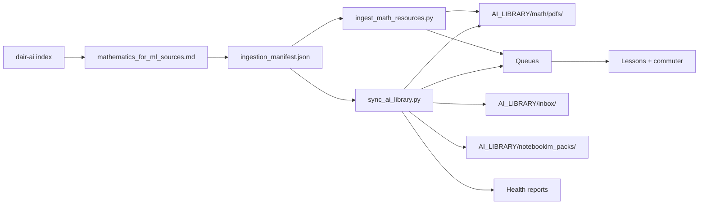
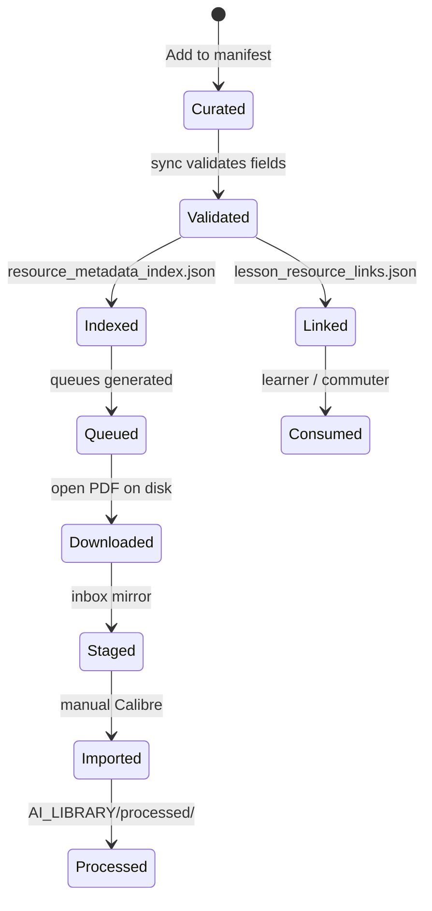

# Resource Pipeline Overview

How curated math resources flow from index → manifest → library → queues → lessons.

**Operating rule:** 70% foundations · 20% applied · 10% frontier scan  
**Curated index:** [dair-ai/Mathematics-for-ML](https://github.com/dair-ai/Mathematics-for-ML)

---

## Pipeline Stages



---

## Stage 1 — Curation

**Input:** External curated lists (starting with dair-ai/Mathematics-for-ML)  
**Output:** `courses/math/resources/mathematics_for_ml_sources.md`

Each entry is classified:

| source_type | Auto-download? |
|-------------|----------------|
| `open_pdf` | Yes, if `copyright_status: open_access` |
| `paper` (arXiv) | Yes, if open_access |
| `web_book` | Link only |
| `course` | Link only |
| `video_playlist` | Link only |
| `reference` | Link only |

Policy details: `courses/math/resources/download_policy.md`

---

## Stage 2 — Manifest Registration

**File:** `courses/math/resources/ingestion_manifest.json`

Human or script edits add resources with full metadata:

- lesson mappings (`lessons[]`)
- difficulty, reinforcement_priority, commute_friendly
- copyright_status, download_allowed
- weakness_tags, exercise_suggestion
- curriculum_tier (foundations / frontier_scan)

The manifest is the **single source of truth**. All downstream artifacts derive from it.

---

## Stage 3 — Ingestion

**Script:** `automation/scripts/ingest_math_resources.py`  
**Default:** dry-run

```bash
# Plan downloads
python automation/scripts/ingest_math_resources.py

# Download open PDFs + build queues
python automation/scripts/ingest_math_resources.py --download --generate-queues
```

### What ingestion does

1. Reads `ingestion_manifest.json`
2. For each `download_allowed: true` + `open_access` resource:
   - Resolves arXiv abs URLs → PDF URLs
   - Validates host against approved patterns
   - Downloads to `/Volumes/AI_MODELS/AI_LIBRARY/math/pdfs/{id}.pdf`
   - Stages copy in `AI_LIBRARY/inbox/`
   - Sets `local_path` on the resource
3. Builds `resource_metadata_index.json`
4. Generates queue files (when `--generate-queues`):
   - `calibre_import_queue/{id}.json`
   - `notebooklm_pack_queue/{id}.md`
   - `commuter_review_queue/{id}.json`

### What ingestion never does

- Bypass paywalls
- Scrape YouTube, Google, NotebookLM, X, Reddit, Hugging Face
- Download commercial textbooks automatically
- Modify production agent systems

---

## Stage 4 — Synchronization

**Script:** `automation/scripts/sync_ai_library.py`  
**Default:** dry-run (reports always written; mirrors on `--apply` only)

```bash
python automation/scripts/sync_ai_library.py          # validate + report
python automation/scripts/sync_ai_library.py --apply  # mirror + regenerate
```

### Sync responsibilities

| Task | Description |
|------|-------------|
| Reconcile paths | Align `local_path` with PDFs on disk |
| Validate metadata | Flag missing lessons, difficulty, priority, copyright |
| Detect duplicates | SHA256 scan of `math/pdfs/` and `inbox/` |
| Mirror PDFs | Copy approved PDFs to `inbox/` for Calibre staging |
| Mirror NotebookLM packs | Copy `.md` packs to `AI_LIBRARY/notebooklm_packs/` |
| Regenerate queues | Refresh all three queue directories |
| Build lesson links | Write `lesson_resource_links.json` |
| Health reports | `sync_status.json`, `resource_health_report.md`, `duplicate_detection.json` |

Reports are written to both the repo and `AI_LIBRARY/sync/`.

---

## Stage 5 — Queue Consumption

Queues are **outputs for manual workflows** — not automated consumers.

| Queue | Path | Used by |
|-------|------|---------|
| Calibre | `calibre_import_queue/` | [CALIBRE_SYNC_WORKFLOW.md](./CALIBRE_SYNC_WORKFLOW.md) |
| NotebookLM | `notebooklm_pack_queue/` | [NOTEBOOKLM_INTEGRATION_GUIDE.md](./NOTEBOOKLM_INTEGRATION_GUIDE.md) |
| Commuter | `commuter_review_queue/` | [COMMUTER_REINFORCEMENT_WORKFLOW.md](./COMMUTER_REINFORCEMENT_WORKFLOW.md) |

Per-lesson commuter files also exist under each week folder (`courses/.../commuter/`).

---

## Stage 6 — Lesson Binding

Resources connect to lessons through three layers:

1. **Manifest** — `lessons[]` on each resource
2. **Generated** — `lesson_resource_links.json` (primary, commute, open_pdf, exercises)
3. **Curated** — `lesson_resource_map.md` (human primary picks)

Graph view: `courses/math/resources/lesson_resource_graph.md`

Example lookup:

```
weakness tag "dot_product"
  → resource_metadata_index.json → by_weakness
  → khan-linear-algebra, imperial-linear-algebra
  → commuter_review_queue/khan-linear-algebra.json
```

---

## Metadata Lifecycle



| State | Signal |
|-------|--------|
| Curated | Entry in `ingestion_manifest.json` |
| Validated | `sync_status.json` → `validation.valid: true` |
| Indexed | Present in `resource_metadata_index.json` |
| Downloaded | `local_path` set and file exists |
| Staged | Copy in `AI_LIBRARY/inbox/` |
| Imported | Book in `AI_LIBRARY/calibre-library/` (manual) |

---

## Open PDF Inventory (Current)

Approved automatic downloads from dair-ai index:

| ID | Source |
|----|--------|
| `gallier-math-deep` | UPenn open course PDF |
| `jaynes-probability` | bayes.wustl.edu |
| `arxiv-matrix-calculus` | arXiv:1802.01528 |
| `arxiv-math-of-ai` | arXiv:2203.08890 |

All other resources remain link-only.

---

## Future Pipeline Extensions (Stubs)

Configured in `automation/config/ai_library_sync.json` — **disabled by default**:

| Extension | Manifest stub | Notes |
|-----------|---------------|-------|
| YouTube transcript index | `AI_LIBRARY/sync/future/youtube_transcript_index.json` | Manual paste only |
| HuggingFace dataset refs | `sync/future/huggingface_dataset_refs.json` | Metadata only |
| arXiv feed monitor | `sync/future/arxiv_feed_monitor.json` | Frontier scan |
| NotebookLM export manifests | `sync/future/notebooklm_export_manifests.json` | Manual export |

---

## Troubleshooting

| Symptom | Check |
|---------|-------|
| Resource missing from lesson | `lesson_resource_links.json` → regenerate sync |
| Validation errors | `resource_health_report.md` |
| PDF not on disk | Run ingest with `--download`; check `copyright_status` |
| Duplicate warnings | `duplicate_detection.json` — expected for pdfs ↔ inbox mirrors |
| Volume not mounted | `/Volumes/AI_MODELS/AI_LIBRARY/` must exist |

---

## Related

- [SYSTEM_ARCHITECTURE.md](./SYSTEM_ARCHITECTURE.md)
- `automation/README.md`
- `courses/math/resources/download_policy.md`
