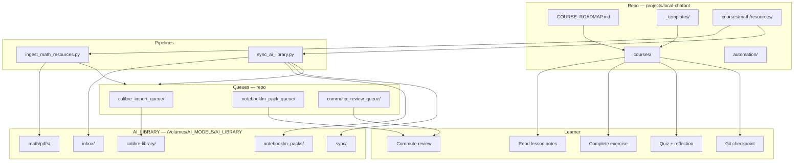

# System Architecture — AI Engineering Lab Course OS

**Checkpoint:** Course Operating System v1  
**Scope:** `projects/local-chatbot/` + `/Volumes/AI_MODELS/AI_LIBRARY/`  
**Operating rule:** 70% foundations · 20% applied projects · 10% frontier scanning

This document describes the architecture of the AI Engineering Lab as a **Course Operating System** — a set of conventions, pipelines, queues, and manual workflows that turn curated resources into repeatable learning loops.

---

## Design Principles

1. **Foundations first** — Month 1 prioritizes Python, Git, APIs, math, and local LLMs before agents or production systems.
2. **Manual over automated for external services** — No automated login to Google, NotebookLM, YouTube, X, Reddit, or Hugging Face.
3. **Repo for metadata, library for binaries** — JSON manifests and queues are version-controlled; PDFs and Calibre libraries live on external storage.
4. **Dry-run by default** — Ingestion and sync pipelines plan changes before applying them.
5. **No production coupling** — The course OS does not modify OpenClaw, MCP, swarm, startup, or production agent systems.

---

## High-Level Architecture



---

## Layer Model

| Layer | Location | Responsibility |
|-------|----------|----------------|
| **Curriculum** | `COURSE_ROADMAP.md`, `courses/` | Week plan, lesson content, exercises, quizzes |
| **Templates** | `courses/_templates/` | Authoring standards for lessons and commuter files |
| **Quality** | `automation/LESSON_CHECKLIST.md` | Gate for marking lessons **ready** |
| **Ingestion** | `automation/scripts/ingest_math_resources.py` | Parse curated index, download open PDFs, build queues |
| **Synchronization** | `automation/scripts/sync_ai_library.py` | Mirror PDFs, validate metadata, regenerate queues, health reports |
| **Manifests** | `courses/math/resources/*.json` | Canonical resource registry and generated indexes |
| **Library storage** | `/Volumes/AI_MODELS/AI_LIBRARY/` | PDFs, Calibre library, NotebookLM pack mirrors |
| **Intelligence (future)** | `intelligence/` | Month 2+ frontier flywheel — stub only |

---

## Core Components

### 1. Lesson Units

Each lesson lives under `courses/{track}/week-XX-topic/`:

```
notes/          → lesson prose (goal, concepts, AI connection, checkpoint)
exercises/      → Python coding task
quizzes/        → recall + reflection
commuter/       → resources, NotebookLM pack, audio prompt, review questions
```

Three **anchor lessons** define the quality bar (Week 2, 3, 4).

### 2. Resource Registry

| File | Role |
|------|------|
| `ingestion_manifest.json` | Source of truth for 20+ curated math resources |
| `resource_metadata_index.json` | Flat index with `by_lesson` and `by_weakness` lookups |
| `lesson_resource_links.json` | Auto-generated lesson → resource mapping |
| `lesson_resource_map.md` | Human-curated primary resources per lesson |
| `mathematics_for_ml_sources.md` | dair-ai/Mathematics-for-ML index |

### 3. Pipelines

| Script | Default mode | Purpose |
|--------|--------------|---------|
| `ingest_math_resources.py` | dry-run | Download open-access PDFs; generate queues |
| `sync_ai_library.py` | dry-run | Validate, mirror, sync, report |

Config: `automation/config/ai_library_sync.json`

### 4. Queues

| Queue | Format | Consumer |
|-------|--------|----------|
| `calibre_import_queue/` | JSON sidecars | Manual Calibre import |
| `notebooklm_pack_queue/` | Markdown source packs | Manual NotebookLM paste |
| `commuter_review_queue/` | JSON review metadata | Commute reinforcement |

### 5. Health & Sync Artifacts

| File | Purpose |
|------|---------|
| `sync_status.json` | Last sync mode, action log, validation summary |
| `resource_health_report.md` | Human-readable health dashboard |
| `duplicate_detection.json` | SHA256 duplicate groups across PDF dirs |

Mirrored copies also live in `AI_LIBRARY/sync/`.

---

## Metadata Schema (Resources)

Every ingested resource carries:

| Field | Purpose |
|-------|---------|
| `lesson` / `lessons` | Lesson slug linkage |
| `topic` | Primary topic label |
| `difficulty` | beginner · intermediate · advanced |
| `reinforcement_priority` | high · medium · low |
| `commute_friendly` | Suitable for audio/video commute |
| `source_type` | open_pdf, web_book, paper, course, video_playlist, reference |
| `copyright_status` | open_access, web_free, reference, commercial_web |
| `local_path` | Path under AI_LIBRARY after download |
| `weakness_tags` | Remediation lookup keys |
| `curriculum_tier` | foundations · applied · frontier_scan |

---

## 70 / 20 / 10 Enforcement

| Tier | ~Share | Manifest signal | Examples |
|------|--------|-----------------|----------|
| **Foundations** | 70% | `curriculum_tier: foundations`, `reinforcement_priority: high` | MML book, Khan LA, week-04 anchor |
| **Applied** | 20% | Exercise suggestions, capstone projects, embeddings bridge | Cosine similarity exercise, API JSON lab |
| **Frontier scan** | 10% | `curriculum_tier: frontier_scan`, `reinforcement_priority: low` | arXiv surveys, ESL, transformer math |

The sync layer validates lesson coverage across all seven lesson slugs: linear_algebra, calculus, probability, statistics, optimization, embeddings, transformers.

---

## Parking Lot (Out of Scope)

These are documented but **not** integrated into the course OS:

- OpenClaw
- MCP servers
- Multi-agent / swarm systems
- Startup infrastructure
- Production agent deployments
- Autoresearch pipelines

See `COURSE_ROADMAP.md` § Parking Lot.

---

## Related Documents

| Document | Topic |
|----------|-------|
| [RESOURCE_PIPELINE_OVERVIEW.md](./RESOURCE_PIPELINE_OVERVIEW.md) | Ingestion + sync flow |
| [COMMUTER_REINFORCEMENT_WORKFLOW.md](./COMMUTER_REINFORCEMENT_WORKFLOW.md) | Commute review loop |
| [NOTEBOOKLM_INTEGRATION_GUIDE.md](./NOTEBOOKLM_INTEGRATION_GUIDE.md) | Audio overview workflow |
| [CALIBRE_SYNC_WORKFLOW.md](./CALIBRE_SYNC_WORKFLOW.md) | PDF library management |
| [WEEKLY_LEARNING_LOOP.md](./WEEKLY_LEARNING_LOOP.md) | Week-by-week learner rhythm |

---

## Quick Reference Commands

```bash
# Ingest curated resources (dry-run)
python automation/scripts/ingest_math_resources.py

# Download open PDFs + generate queues
python automation/scripts/ingest_math_resources.py --download --generate-queues

# Sync library (dry-run + reports)
python automation/scripts/sync_ai_library.py

# Apply mirrors and regenerate queues
python automation/scripts/sync_ai_library.py --apply
```
