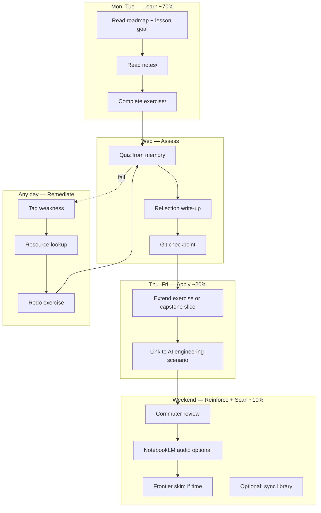
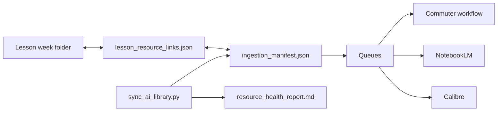

# Weekly Learning Loop

The standard rhythm for one week of AI Engineering Lab study.

**Operating rule:** 70% foundations · 20% applied projects · 10% frontier scanning  
**Month 1 pacing:** 6 weeks — see `COURSE_ROADMAP.md`

---

## Loop Overview



---

## Day-by-Day Template

### Monday — Orient (30–45 min)

| Step | Action |
|------|--------|
| 1 | Open `COURSE_ROADMAP.md` → confirm current week folder |
| 2 | Read `notes/` lesson goal and core concepts |
| 3 | Skim `commuter/resources.md` — pick one primary link for the week |
| 4 | Check `lesson_resource_links.json` for mapped math resources (if applicable) |

**Output:** You can state the lesson goal in one sentence.

### Tuesday — Build (60–90 min)

| Step | Action |
|------|--------|
| 1 | Read full lesson notes + AI engineering connection |
| 2 | Complete `exercises/` script — run and verify output |
| 3 | If stuck: weakness remediation (below) |

**Output:** Working exercise; terminal output saved or observed.

### Wednesday — Assess (30–45 min)

| Step | Action |
|------|--------|
| 1 | Answer `quizzes/` from memory — no notes |
| 2 | Write reflection (quiz file or journal) |
| 3 | Complete Git checkpoint from lesson notes |
| 4 | Mark lesson progress in personal `PROGRESS.md` (optional) |

**Output:** Git commit on your branch.

### Thursday — Apply (45–60 min) · ~20% tier

| Step | Action |
|------|--------|
| 1 | Pick `exercise_suggestion` from linked resource in manifest |
| 2 | Extend Tuesday's exercise with one AI scenario (RAG, API, embedding, etc.) |
| 3 | For math weeks: connect to `courses/math/resources/lesson_resource_map.md` |

**Output:** Extended script or written scenario doc.

### Friday — Connect (30 min)

| Step | Action |
|------|--------|
| 1 | Explain the week's concept as if teaching a colleague |
| 2 | Write one paragraph: "This matters for AI engineering because…" |
| 3 | Preview next week's roadmap entry |

**Output:** Teaching note or README snippet.

### Weekend — Reinforce (commute-friendly)

| Step | Action |
|------|--------|
| 1 | Commute: [COMMUTER_REINFORCEMENT_WORKFLOW.md](./COMMUTER_REINFORCEMENT_WORKFLOW.md) |
| 2 | Optional: [NOTEBOOKLM_INTEGRATION_GUIDE.md](./NOTEBOOKLM_INTEGRATION_GUIDE.md) |
| 3 | Optional desk: import one PDF via [CALIBRE_SYNC_WORKFLOW.md](./CALIBRE_SYNC_WORKFLOW.md) |
| 4 | Frontier scan (10%): skim one `frontier_scan` resource — no deep study |

**Output:** Completed `review_questions` self-check.

---

## Month 1 Week Map

| Week | Focus | Anchor / status | Primary loop emphasis |
|------|-------|-----------------|----------------------|
| 1 | Python basics | scaffold | foundations — syntax, files |
| 2 | Python + Git | **ready** | foundations — project + version control |
| 3 | APIs + JSON | **ready** | foundations — HTTP + parsing |
| 4 | Linear algebra | **ready** | foundations — vectors + similarity |
| 5 | Statistics | scaffold | foundations — distributions |
| 6 | NumPy/Pandas + local LLM | scaffold | foundations + applied bridge |

Weeks 2–4 are the quality bar. Match their structure when authoring scaffolds.

---

## Weakness Remediation (Any Day)

When quiz or exercise exposes a gap:

1. **Tag it** — use manifest weakness tags (`dot_product`, `chain_rule`, etc.)
2. **Lookup** — `resource_metadata_index.json` → `by_weakness`
3. **Choose resource** — prefer `reinforcement_priority: high` and `commute_friendly` if commuting
4. **Review** — `commuter_review_queue/{id}.json` + redo exercise
5. **Re-assess** — re-answer quiz question that failed

Do not advance to the next week with unresolved anchor-lesson gaps.

---

## Reinforcement Loop Architecture

The weekly loop connects four systems:

| System | Role in loop |
|--------|--------------|
| **Lesson units** | Structured learning + assessment |
| **Resource pipeline** | Curated math/external resources |
| **Queues** | Commuter, NotebookLM, Calibre staging |
| **Library sync** | PDF mirrors, health validation |



---

## 70 / 20 / 10 Weekly Time Budget

Suggested ~5–8 hours/week:

| Tier | Hours | Activities |
|------|-------|------------|
| **70% Foundations** | 3.5–5.5h | Notes, exercises, quizzes, Git, Khan/Imperial resources |
| **20% Applied** | 1–1.5h | Exercise extensions, scenario writing, capstone slices |
| **10% Frontier** | 0.5h | arXiv skim, `deeplearningmath` scan, intelligence/ stub awareness |

Month 1: cap frontier at 30 min/week unless foundations quiz scores are consistently passing.

---

## End-of-Week Checklist

- [ ] Lesson notes read and exercise runs cleanly
- [ ] Quiz completed from memory; reflection written
- [ ] Git checkpoint committed
- [ ] At least one commute review session
- [ ] Applied extension attempted (Thursday task)
- [ ] Weaknesses tagged and at least one remediation resource consulted
- [ ] Optional: `python automation/scripts/sync_ai_library.py` if manifest changed

Validate lesson quality against `automation/LESSON_CHECKLIST.md` before marking new lessons **ready**.

---

## End-of-Month 1 Gate

Before Month 2:

- [ ] All three anchor lessons complete (weeks 2, 3, 4)
- [ ] Can explain cosine similarity + API JSON parsing + Git workflow
- [ ] Calibre contains at least matrix calculus or MML companion PDF
- [ ] `resource_health_report.md` shows zero validation errors
- [ ] Parking lot items (OpenClaw, MCP, swarms) not started — by design

---

## Related Documents

| Document | Use when |
|----------|----------|
| [SYSTEM_ARCHITECTURE.md](./SYSTEM_ARCHITECTURE.md) | Understanding the full OS |
| [RESOURCE_PIPELINE_OVERVIEW.md](./RESOURCE_PIPELINE_OVERVIEW.md) | Running ingest/sync |
| [COMMUTER_REINFORCEMENT_WORKFLOW.md](./COMMUTER_REINFORCEMENT_WORKFLOW.md) | Weekend commute |
| [NOTEBOOKLM_INTEGRATION_GUIDE.md](./NOTEBOOKLM_INTEGRATION_GUIDE.md) | Audio overview |
| [CALIBRE_SYNC_WORKFLOW.md](./CALIBRE_SYNC_WORKFLOW.md) | PDF library |
| `COURSE_ROADMAP.md` | Curriculum plan |
| `courses/README.md` | Lesson structure |

---

## Quick Start (This Week)

```bash
# 1. Confirm week folder in COURSE_ROADMAP.md
# 2. Work through notes → exercise → quiz → git checkpoint
# 3. Weekend: open week-XX/commuter/review_questions.md

# Optional library maintenance after manifest edits:
python automation/scripts/sync_ai_library.py --apply
```
